## Pokemon Lab

A browser-based Pokémon lab built with React, combining a Pokédex, TCG simulator, Trainer Dex, Team Planner, Quiz, and "Who's That Pokémon?" in one retro-styled interface.

Demo: https://pokemon-lab-react.vercel.app/

## Screenshots

| Pokédex | TCG Simulator |
| --- | --- |
| 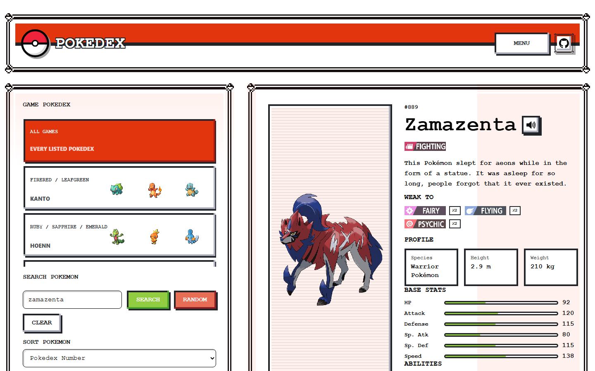 | 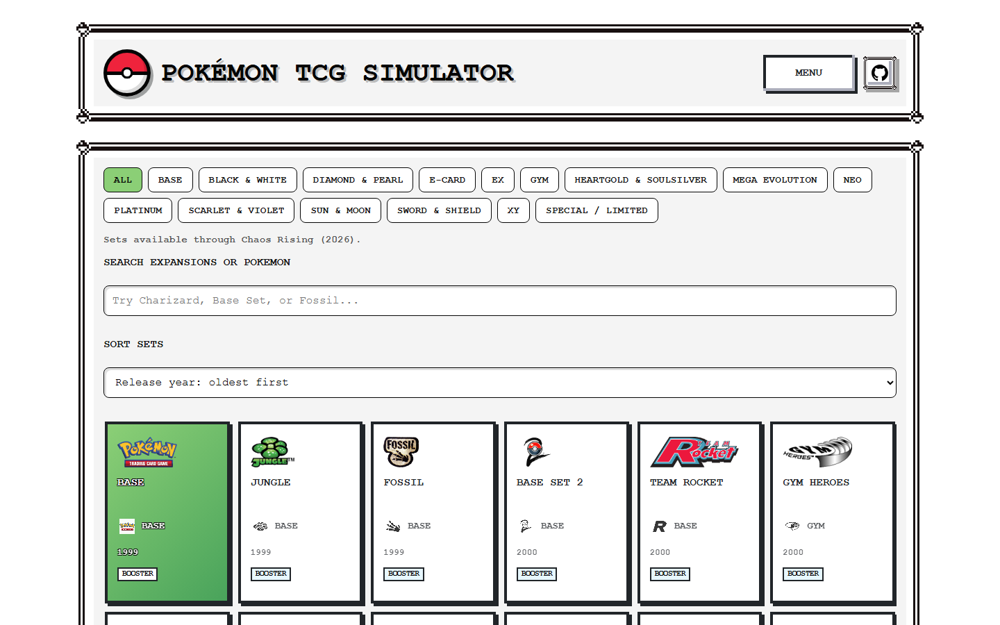 |
| **Who's That Pokémon?** | **Team Planner** |
| 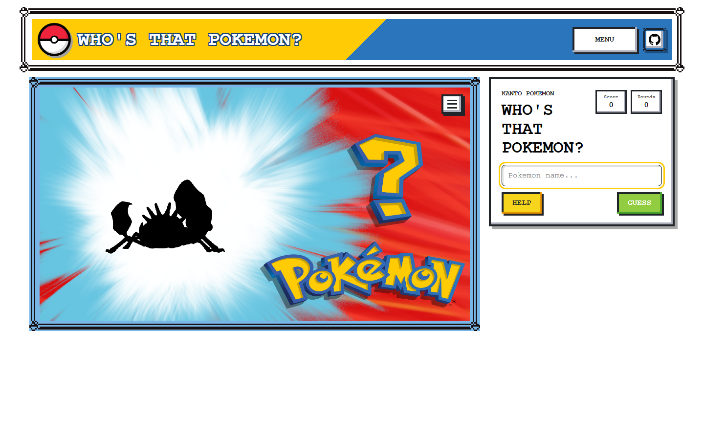 | 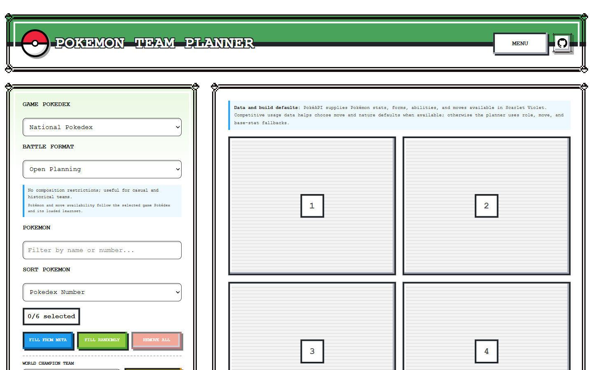 |
| **Pokémon Quiz** | **TrainerDex** |
| 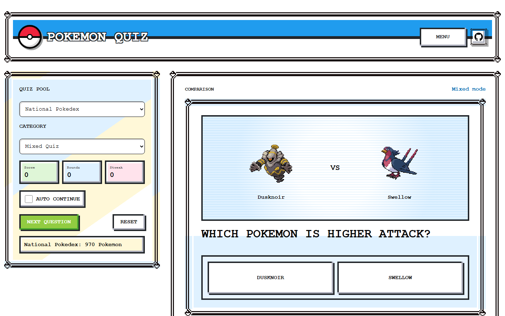 | 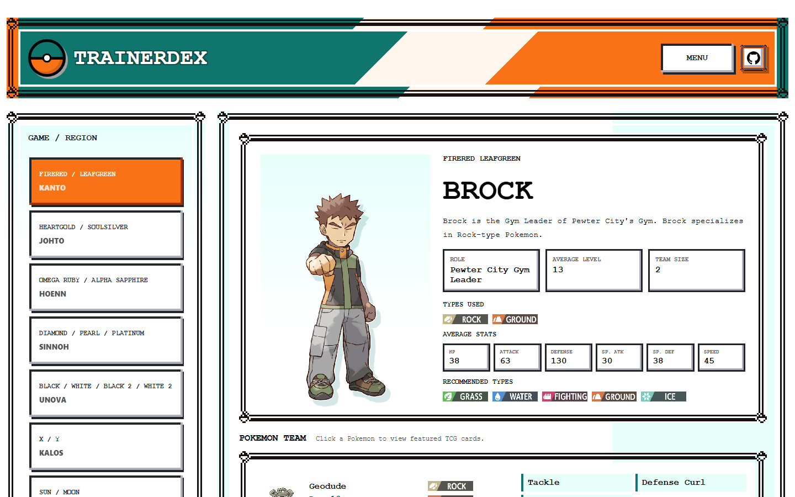 |

### Video walkthroughs

**Pokédex — search for Pikachu, browse Featured TCG Cards, and open a card**

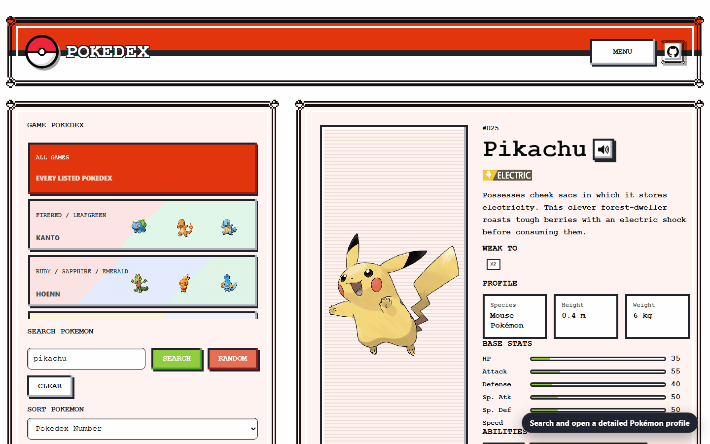

**TCG Simulator — open a Base Set pack and verify the binder increases from 0 to 9 unique cards**

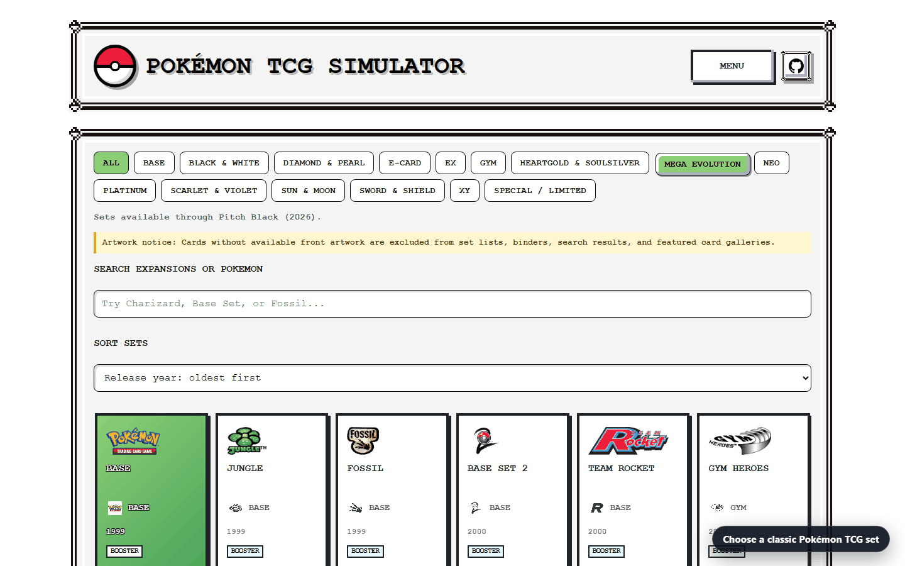

**Who's That Pokémon? — start a Kanto challenge, use a hint, and reveal the answer**

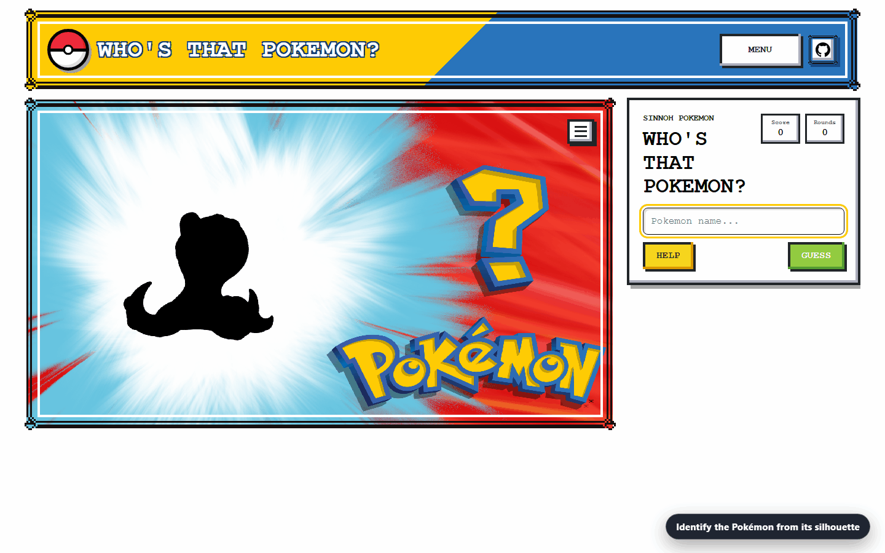

**Team Planner — generate a six-Pokémon team and review its team-building guidance**

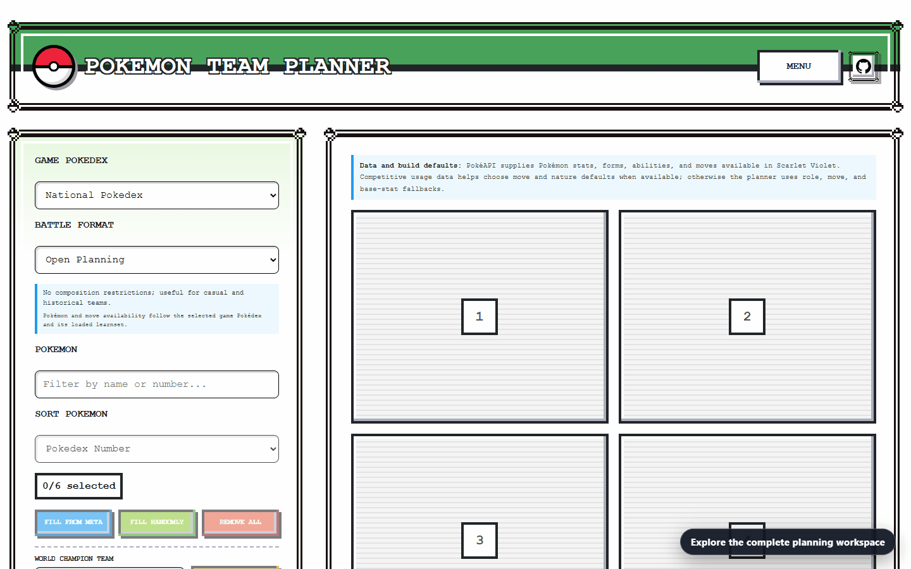

**Pokémon Quiz — start a mixed quiz and answer a question**

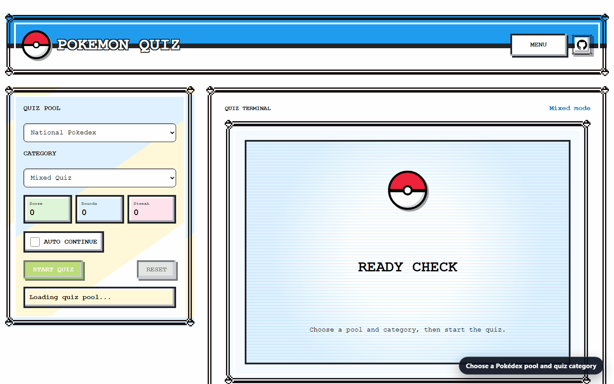

**TrainerDex — browse trainer profiles, review team analysis, and explore featured cards**

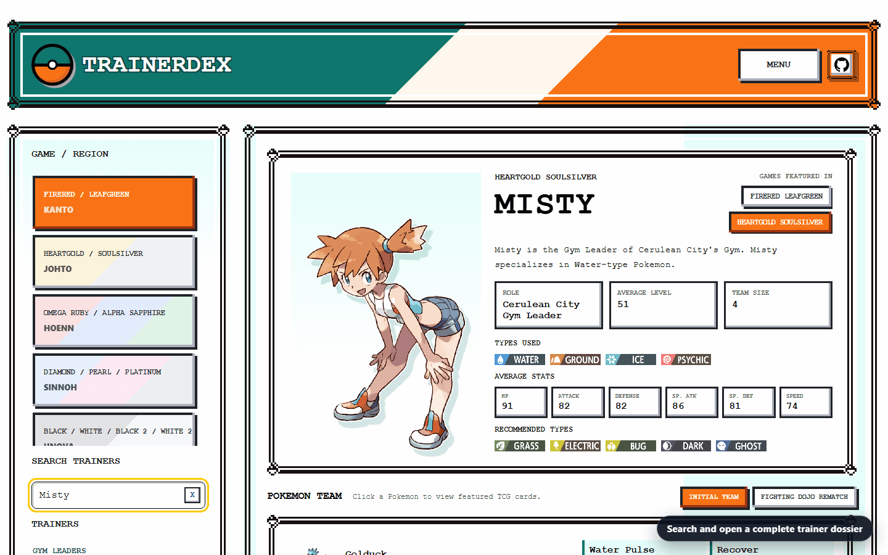

## Features

- **Pokédex** — browse by game/region, search, view stats, weaknesses, abilities, evolutions, forms, moves, cries, and generation sprites
- **TCG Simulator** — open single, ten-pack, random, and God Pack pulls; track collection in a binder with set filters, search, and card detail views
- **Trainer Dex** — browse Gym Leaders, Elite Four, Champions, Kahunas, and special trainers by region, with teams, type analysis, counters, and rematch info
- **Team Planner** — build a casual six-Pokémon team manually or with meta-aware, random, and World Champion roster fills; configure forms, abilities, moves, and natures; and review format legality, team roles, nature-adjusted stats, move balance, type coverage, and suggested swaps
- **Who's That Pokémon?** — silhouette guessing game with hints, scoring, and a saved leaderboard
- **Pokémon Quiz** — mixed-category questions covering types, evolutions, generations, stats, cries, moves, and effectiveness

See the [detailed station feature reference](docs/STATION_FEATURES.md) for complete behavior, data sources, persistence, and current scope.

Retro NES/Game Boy visual style with responsive layouts. PokéAPI responses and sprites are cached locally via IndexedDB to minimise repeat requests.

## Development

```bash
npm install
npm run dev
```

## About

Personal project, not for commercial use. Built to study React and experiment with Pokémon data and small game-like tools. AI coding tools were used during development. All Pokémon, TCG, and related assets belong to their respective owners.
